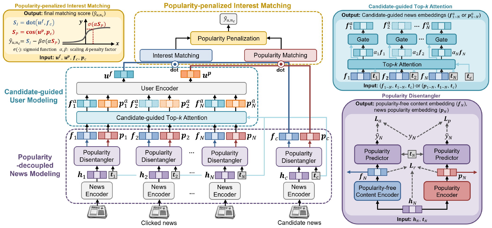

# POPCORN: Popularity-decoupled Interest Matching for Personalized News Recommendation

This repository provides the official implementation of **POPCORN** (**POP**ularity-de**CO**upled inte**R**est matchi**N**g), a model-agnostic framework for popularity-debiased personalized news recommendation, as described in our paper *POPCORN: Popularity-decoupled Interest Matching for Personalized News Recommendation* (under review at CIKM 2026).

## Overview


POPCORN mitigates **popularity bias** in news recommendation by decoupling a user's genuine, interest-driven clicks from popularity-driven clicks. It is **model-agnostic**: it can be plugged on top of an existing news/user encoder without modifying its architecture. POPCORN consists of three components:

- **I1 — Popularity-decoupled News Modeling**: disentangles each news representation into an interest-relevant part and a popularity-relevant part, and distinguishes interest-driven from popularity-driven clicks.
- **I2 — Candidate-guided User Modeling**: amplifies the user's interest signal for a candidate news via candidate-guided Top-K attention over the click history.
- **I3 — Popularity-penalized Interest Matching**: penalizes recommendations for news that are popular but not genuinely interesting to the user.

## Available dataset
1. [MIND Dataset](https://msnews.github.io/) (MIND-small, MIND-200k, MIND-large)
2. [Adressa Dataset](https://reclab.idi.ntnu.no/dataset/)
3. [EB-NeRD Dataset](https://recsys.eb.dk/)

## Dependencies
Install the dependencies with:
```
bash install_dependencies.sh
```
Our experiments require `python 3.10`, `torch==2.1.0` (CUDA `cu118`), `torchtext==0.16.0`, and `torch-scatter==2.1.2`. The [torch-scatter](https://github.com/rusty1s/pytorch_scatter) package is required for the GCN operations. If the dependency installation fails, please follow the instructions at [https://github.com/rusty1s/pytorch_scatter](https://github.com/rusty1s/pytorch_scatter) to install it manually.

## Dataset Preparation
By default the experiments run on **MIND-small**. The code expects the dataset under the sibling directory `../MIND-small` (see `config.py` and `prepare_MIND_dataset.py`).

To download, extract, and preprocess MIND-small automatically, run:
```
bash download_extract_MIND.sh
```
This downloads `MINDsmall_train.zip`, `MINDsmall_dev.zip`, and the Wikidata knowledge graph into `../MIND-small`, then calls `python prepare_MIND_dataset.py` to format the dataset. After preparation, the directory should look like:
```
../MIND-small
├── train
│   ├── news.tsv
│   ├── behaviors.tsv
│   ├── entity_embedding.vec
│   └── relation_embedding.vec
├── dev
│   └── ...
└── wikidata-graph
    └── ...
```
If the automatic download fails due to an unstable network, download the MIND dataset and knowledge graph manually using the links in `download_extract_MIND.sh`.

## Hyperparameters
Default training hyperparameters (see `config.py`):

| Hyperparameter | Value |
| --- | --- |
| Optimizer | Adam |
| Learning rate | 1e-4 |
| Dropout | 0.2 |
| Batch size | 32 |
| Epoch | 16 |
| Early stopping epochs | 5 |
| # of negative samples | 4 |
| Max title length | 32 |
| Max abstract length | 128 |
| Max history length | 50 |
| Word embedding dim | 300 |
| # of GCN layers | 4 |

POPCORN-specific hyperparameters (see `config.py`):

| Hyperparameter | Argument | Value |
| --- | --- | --- |
| # of popularity classes (I1) | `--popcorn_num_pop_classes` | 50 |
| Popularity loss weight (I1) | `--popcorn_lambda_pop` | 0.5 |
| Top-K history (I2) | `--popcorn_top_k` | 30 |
| Penalty scaling α (I3) | `--popcorn_alpha` | 0.1 |
| Penalty weight β (I3) | `--pop_penalty_weight` | 2.0 |
| InfoNCE temperature (I3) | `--temperature` | 0.1 |

## How to run
Training (`--mode=train`, the default) trains the model and then automatically evaluates the best checkpoint on the test set.

**POPCORN (full model)** on top of the default base encoders (MHSA news encoder + ATT user encoder):
```
python main.py --news_encoder=POPCORN --user_encoder=POPCORN --click_predictor=POPCORN \
               --popcorn_base_news_encoder=MHSA --popcorn_base_user_encoder=ATT \
               --use_I1 --use_I2 --use_I3 --dataset=small
```

**Model-agnostic backbones.** POPCORN can be applied to other base encoders via `--popcorn_base_news_encoder` (`MHSA`, `NAML`, `CNE`, `CNN`, `CROWN`, `PENR`, `PLMMiner`) and `--popcorn_base_user_encoder` (`ATT`, `MHSA`, `CATT`, `GRU`, `SUE`, `LSTUR`, `CROWN`, `PENR`, `MINER`). For example, POPCORN on a NAML backbone:
```
python main.py --news_encoder=POPCORN --user_encoder=POPCORN --click_predictor=POPCORN \
               --popcorn_base_news_encoder=NAML --popcorn_base_user_encoder=ATT \
               --use_I1 --use_I2 --use_I3 --dataset=small
```

**Base model without POPCORN** (e.g., the MHSA + ATT backbone):
```
python main.py --news_encoder=MHSA --user_encoder=ATT --dataset=small
```

**Ablations.** Enable each component independently with `--use_I1`, `--use_I2`, `--use_I3`.

**Other datasets.** Switch datasets with `--dataset` (`small`, `200k`, `large`, `adressa`, `eb-nerd`).

<!-- **Multi-GPU training.** Distributed training is supported via `--world_size=N` (the `batch_size` must be divisible by `world_size`):
```
python main.py --news_encoder=POPCORN --user_encoder=POPCORN --click_predictor=POPCORN \
               --use_I1 --use_I2 --use_I3 --batch_size=128 --world_size=4
``` -->

## Citation
This paper is currently under review. Author and citation information are withheld for anonymity and will be added upon acceptance.
```
@inproceedings{popcorn2026,
  title     = {POPCORN: Popularity-decoupled Interest Matching for Personalized News Recommendation},
  author    = {Anonymous},
  booktitle = {Under review at the ACM International Conference on Information and Knowledge Management (CIKM)},
  year      = {2026}
}
```

<!-- ## Acknowledgements
This codebase builds upon the neural news recommendation framework of [CNE-SUE](https://github.com/Veason-silverbullet/NNR) (Mao et al., *Findings of EMNLP 2021*). -->
